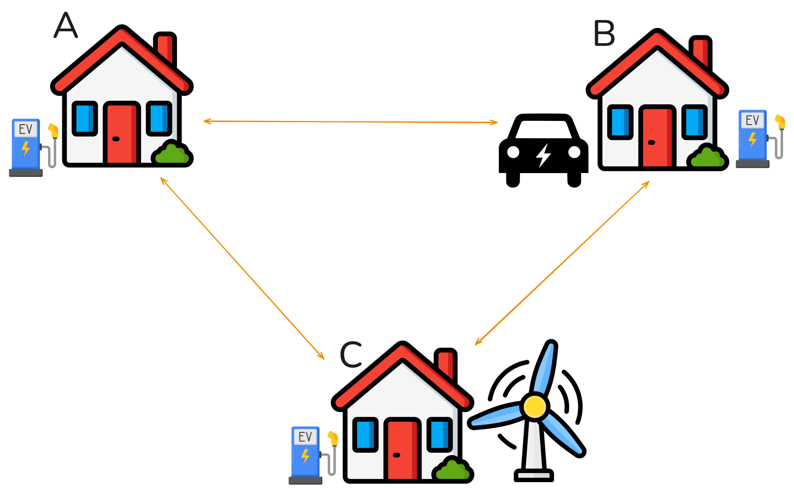

# IOT_GRP5
Dieses Repository beschreibt den IoT Usecase für das Studium MCCE2024 der Gruppe 5 sowie alle notwendigen Code-Snippets.

## Use Cases
Folgende Grafik beschreibt die Zusammensetzung der drei Häuser A, B und C symbolisch.

### Alle Häuser
Jedes Haus besitzt einen Energiespeicher (Batterie), welcher einen individuellen Wert besitzt, welcher pro Haus unterschiedlich ist.
Jeder Verbraucher des Hauses verbraucht somit Energie von dem genannten Energiespeicher. Der Verbrauch ist je nach Verbraucher unterschiedlich.
Eine Lampe benötigt weniger Energie als das Laden eines Autos usw. Der Verbrauch der jeweiligen Verwender kann auch je Haus variieren: z.B. LED vs. Glühbirne.

Alle Häuser verfügen zudem über ein Energie-Warnsignal, welches die anderen Häuser benachrichtet, sollte der Energiespeicher unter 40% kapazität liegen. Die informierten Häuser können anschließend das Haus welches sich im Notfall befindet mit der eigenen Energie versorgen. Die Steuerung hierzu erfolgt über dIE IoT Plattform.

### Haus A - Smart Home
Haus A ist ein energiehungriges Haus. Lüfter als elektrische Last mit kontinuierlichem Verbrauch bei Aktivität. Tür über Servo, jede Bewegung verbraucht einmalig fünf Prozent Batterie. Fenster über Servo, jede Bewegung verbraucht einmalig fünf Prozent Batterie. Buzzer spielt eine einfache Super Mario Melodie, solange er im Menü aktiviert ist. 
Dabei funktioniert die Steuerung über ein Menü mit welchem man alle Verbrauer steuern kann. (Button eins kurzer Druck wählt das nächste Gerät im Menü; Button eins langer Druck wählt das vorherige Gerät im Menü; Button zwei kurzer Druck schaltet das aktuell gewählte Gerät ein oder aus)
Der Menüpunkt Reset setzt die Batterie auf hundert Prozent und schaltet alle Verbraucher aus.

### Haus B - Elektro Auto Besitzer
Der Besitzer des Hauses besitzt ein E-Auto, welches an jeder Ladesäule der Gemeinschaft geladen werden kann. Durch die Identifiaktion des Verwenders über RFID kann nachgewiesen werden, welches Haus die Ladetätigkeit verwendet. Somit wird zuerst der Energiespeicher des Hauses welches die Ladesäule besitzt verringert, während dessen der Verwender den Verbrauch begleicht indem er Energie weiterleitet.

Beispiel:
Da nur Haus B ein E-Auto besitzt und er dieses nicht bei sich sondern bei Haus A läd, sendet Haus B and Haus A die Verbrauchte Energiemenge um den Verbrauch auszugleichen.
Der Energieverlust wird dem Besitzerhaus (dem Haus, zu dem der RFID-Chip gehört) belastet und das Ladehaus erhält diesen Energieanteil zurückerstattet.

### Haus C - Energieerzeuger mittels Windenergie
Haus C besitzt ein Windkraftwerk (Lüfter).
Wenn lokal Strom verbraucht wird, schaltet sich das Windrad automatisch ein und lädt die Batterie, sollte diese unter einen bestimmten Wert fallen.
Wenn es mit anderen Häusern vernetzt ist, startet es vorausschauend, sobald eines Energie verbraucht oder anfordert, um Reserveleistung aufzubauen.
Das System bildet also das Konzept Predictive Renewable Response – Energieerzeugung auf Basis erwarteter Last.
